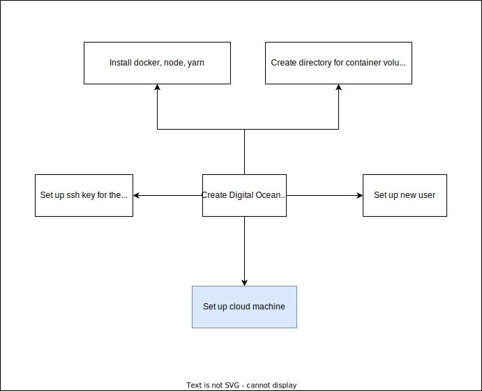
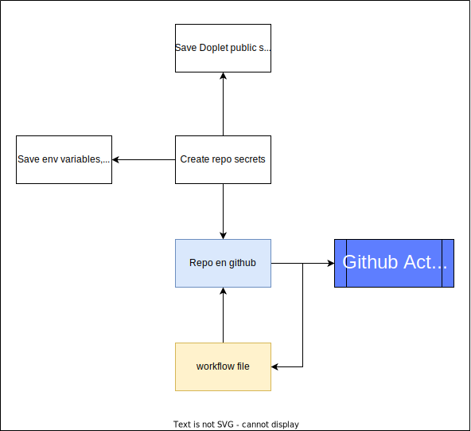
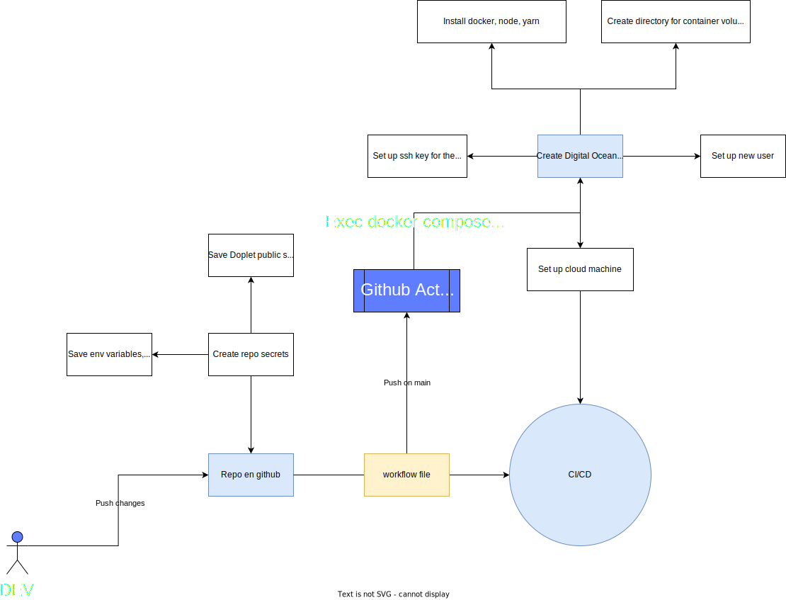

# CI/CD Pipeline github actions-digital ocean

We need to do a couple of things to be able to set up the CI/CD  pipeline, there are to blocks

> `Cloud machine configuration` that we need to have ready before start with the github actions

1. Set up an account in DigitalOcean
2. Create a droplet with Ubuntu LTS
3. Install all project's dependencies
    - Docker
    - Node
    - Yarn
    - Set up directory to store mongo data of the services
    - ...
4. Create a new user to be used to run the from Github actions
6. Create ssh key to connect to the Droplet from Github actions
7. Install proxy server (Nginx)

> `Github actions set up` we need to save as secrets the cloud machine, next we add github actions to the repo in the Actions options and configure.

1. Set up the repo with Github actions
2. Clone your repo
3. Set up secrets for your pipeline
4. Set up the pipeline file configuration [See](.github/workflows/deploy.yml)
5. Do some changes
6. Push the changes
7. Pipeline start On Push main branch

# All together

> Everytime we psuh a change to main in this case, the pipeline is triggered

