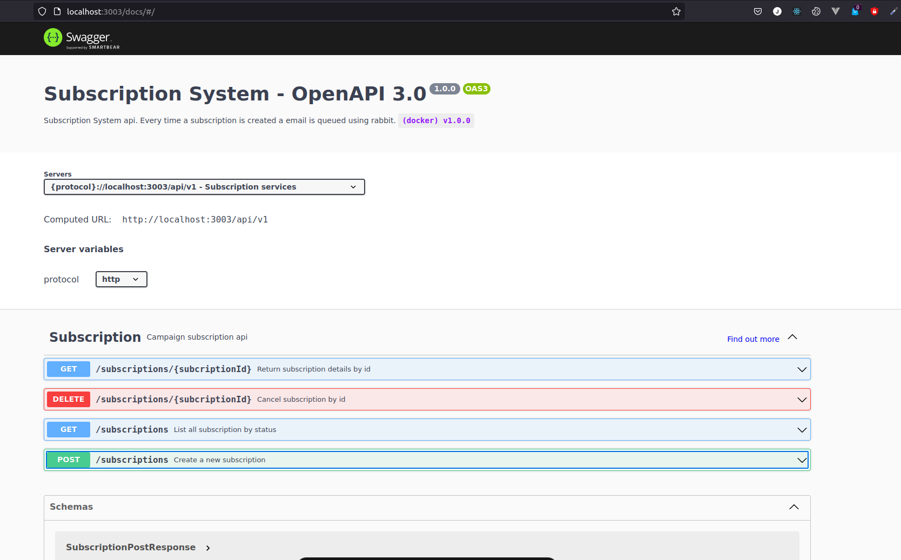

# Subscription System


Monorepo for Subscription emulator system



## Projects

- **[common](./packages/common)**
    > Shared library
- **[email-service](./packages/email-service)**
    > Microservice implementing email notifications. No need to implement real email
send process, you can create a Mock interface.
- **[public-service](./packages/public-service)**
    > Backend for Frontend microservice to be used by UI frontend. Services to create, cancel, list subsciptions.
- **[subscription-service](./packages/subscription-service)**
    > Microservice implementing subscription logic, including persistence of
subscription data in a database and email notification to confirm process is completed.

## Project dependencies

|Program|Version|
|------|------|
|Node|18.14.0|
|Yarn|1.22.19|
|Docker|23.0.1|
|Docker Compose |2.3.3|

## Run locally on docker

>   First of all we need to create the `.env` file in the root folder. Example

```env
    DB_USERNAME=dbnamehere
    DB_PASSWORD=dbpasshere
    DB_DATA_DIR=volume_dir
    MQ_USERNAME=mquserhere
    MQ_PASSWORD=mqpasshere
    CACHE_TTL=3600
```

1. Please, install the project dependencies
2. Clone the project using with git or download it and unzip it
3. Run the following command from the root folder

    ```bash
    docker compose up -d
    ```
4. Navigate in your browser to 
    > [http://localhost:3003](http://localhost:3003)
5. Use the swagger ui to make request

## Run locally without docker

1. Please, install the project dependencies
2. Clone the project using with git or download it and unzip it
3. Run the following commands from the root folder

    - In the terminal go to dev/ directory and run this command
        ```bash
        docker compose up -d
        ```
    - From the root directory run
        ```bash
        yarn build
        ```
    - Run this in a new tab
    
        ```bash
        yarn workspace subscription-service
        ```
        ```bash
        yarn workspace public-service
        ```
        ```bash
        yarn workspace email-service
        ```
4. Open a tab in the browser and navigate to 
    > [http://localhost:3001](http://localhost:3001)
5. Use the swagger ui to make request


## Library used

1. Expressjs
    > Fast, unopinionated, minimalist web framework for Node.js.I use to hanler HTTP request easyly on the services.
2. Typescript
    > Is a language for application-scale JavaScript, allow me to write code strongly typed and compile error. I use it to develop the services
3. Nodemon
    > Is a tool that helps develop Node.js based applications by automatically restarting the node application when file changes in the directory are detected. I use it to get instance app refresh while I code and test
4. amqplib
    > A library for making AMQP 0-9-1 clients for Node.JS, and an AMQP 0-9-. I use to to connect to put/consume messages from Rabbit.
5. Mongoose
    > Is a MongoDB object modeling tool designed to work in an asynchronous environment. I use it to save the subscriptions.
6. mocha & chai & sinojs & supertest
    > Libraries/Framework to run unit testd.
7. Zod
    > TypeScript-first schema validation with static type inference. I use it to validate the new subscription data before insert it in the database.
8. ESlint
    > ESlint statically analyzes your code to quickly find problems. It is built into most text editors and you can run ESLint as part of your continuous integration pipeline. I use it to statically analyze my code and use the best code practices